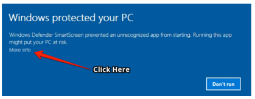

# InstantWP ReadMe for Windows

Welcome to InstantWP!

This file contains some useful information on running InstantWP on Windows.

## Starting InstantWP

Most of the time, you should just be able to double click on the Start-InstantWP.bat file and InstantWP should run.

However, on some Windows systems there is a new security filter called SmartScreen. This will stop InstantWP running with a dialog asking if the user wishes to continue.

In order to start InstantWP on these systems, you will need to click on the 'More info' link on the dialog:

Then click on the 'Run anyway' button on the resulting dialog:

You should only need to do this once.

## Firewall Dialogs

You may get a query from the Windows Firewall asking if it is OK to run the 'instantwp-qemu-i386w.exe' application.

This is the InstantWP Virtual Machine starting up and should be allowed to run so that InstantWP can function correctly.

## Other security dialogs

You may see other security dialogs when clicking on the buttons on the Advanced dialog. 

You can handle these dialogs as outlined above.

## KiTTY SSH Warning

The first time you start the SSH Terminal you may be asked to cache the server's host key by the SSH client software (KiTTY.exe). You should click "Yes" on this dialog and you should not see it again for this InstantWP install.

## My Anti-Virus says that InstantWP is a Trojan!

Some Anti-Virus vendors will classify any software that their system does not know as malware. This is a false positive. InstantWP contains no spyware or malware. 

InstantWP has been around since 2008 and is used daily by hundreds of thousands of businesses, universities and individuals. You are quite safe :)

## Why do I need to start InstantWP this way? 

All developers on Windows need to 'code sign' their Windows apps to avoid security warnings. This is a digital signature that provides proof that the developer is legitimate. Of course, the code in InstantWP is code signed by Seamus Brady, the founder of Corvideon Ltd, the Irish software company behind InstantWP.

However batch files cannot be code signed. InstantWP is portable and it needs a batch file to set up various file paths. This can cause these extra security dialogs.

Also the Windows SmartScreen filter still asks the user about certain types of apps (for instance, newly released software), even if they have been code signed. 

For more information of Windows SmartScreen filter see [https://support.microsoft.com/en-us/help/17443/windows-internet-explorer-smartscreen-filter-faq ]().

## InstantWP Requirements

InstantWP should run on 32 bit and 64 bit versions of Windows 10, Windows 7 and recent versions of Windows Server.

It is suggested that you have at least 4GB of RAM to run InstantWP but the amount of RAM that is needed can be adjusted if you wish. 

InstantWP also needs a recommended 300MB of disk space.

On Windows systems, InstantWP may not run correctly if there are spaces in the InstantWP directory path.

## InstantWP Documentation

Please look in the docs folder for the InstantWP User Guide.

## InstantWP Project Links

 * See the InstantWP for full details: [http://www.instantwp.com ](http://www.instantwp.com).

 * For troubleshooting and technical tips, please see the [InstantWP FAQ ](http://www.instantwp.com/go/FAQ/).

 * The code for InstantWP is available at the [InstantWP GitHub project ](https://github.com/corvideon/InstantWP/).

## License

InstantWP is released under the GPL v3. See the included LICENSE file.

--
&copy; Corvideon 2017 