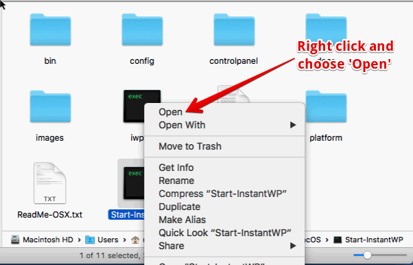

# InstantWP ReadMe for macOS

Welcome to InstantWP!

This file contains some useful information on running InstantWP on macOS.

## Starting InstantWP

Most of the time, you should just be able to double click on the Start-InstantWP script and InstantWP should run.

However, on some macOS systems there is a new security service called GateKeeper. This will stop InstantWP running as it is started by a script file (called a 'Unix application' in the warning dialog).

In order to start InstantWP on these systems, you may need to right click on the Start-InstantWP script and click Open:

Then click on the 'Open' button on the resulting dialog:

You will only need to do this once.

## Firewall Dialogs

You may get a query from the macOS Firewall asking if it is OK to run the 'instantwp-qemu-i386' application.

This is the InstantWP Virtual Machine starting up and should be allowed to run so that InstantWP can function correctly.

## Other security dialogs

You may see other security dialogs when clicking on the buttons on the Advanced dialog. 

You can click 'Open' on these dialogs also:

If you get the error below, just click OK and then click the button again. The command should run OK. This should only happen once.

## Why do I need to start InstantWP this way? 

Due to recent changes in macOS, all developers need to 'code sign' their macOS apps. This is a digital signature that provides proof that the developer is legitimate. Of course, the code in InstantWP is code signed by Seamus Brady, the founder of Corvideon Ltd, the Irish software company behind InstantWP.

However, InstantWP is a portable app and needs certain file paths set up before startup. This can only be done using a script file and unfortunately these cannot be code signed. This is the reason for the 'right click' trick to start InstantWP.

For more information of macOS security see [https://support.apple.com/en-us/HT202491 ]().

## InstantWP Documentation

InstantWP should run on the most recent versions of macOS. 

It is suggested that you have at least 4GB of RAM to run InstantWP but the amount of RAM that is needed can be adjusted if you wish. 

InstantWP also needs a recommended 300MB of disk space.

## InstantWP Documentation

Please look in the docs folder for the InstantWP User Guide.

## InstantWP Project Links

 * See the InstantWP for full details: [http://www.instantwp.com ](http://www.instantwp.com).

 * For troubleshooting and technical tips, please see the [InstantWP FAQ ](http://www.instantwp.com/go/FAQ/).

 * The code for InstantWP is available at the [InstantWP GitHub project ](https://github.com/corvideon/InstantWP/).

## License

InstantWP is released under the GPL v3. See the included LICENSE file.

--
&copy; Corvideon 2017 